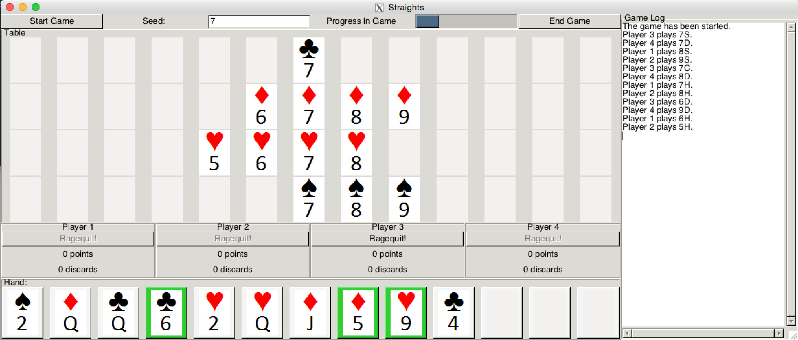

#Straights Card Game in C++

Straights is a card game implemented in C++ for CS 247 project.

How to play [Straights] (https://www.student.cs.uwaterloo.ca/~cs247/current/Assignments/P1/HowToPlayStraights.pdf)

#Screenshot

Run it yourself
---------------

Install gtkmm (for the UI), a graphics library for C++.

To run the executable:

    make
    ./straights

    

